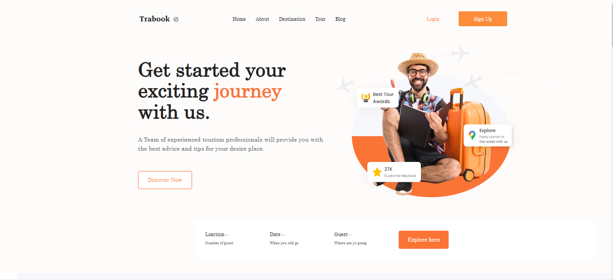
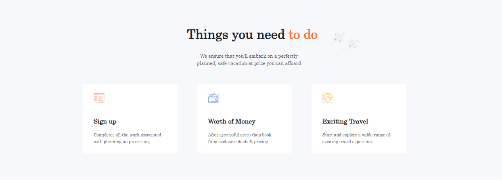
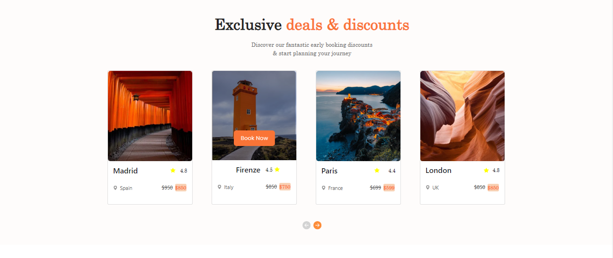
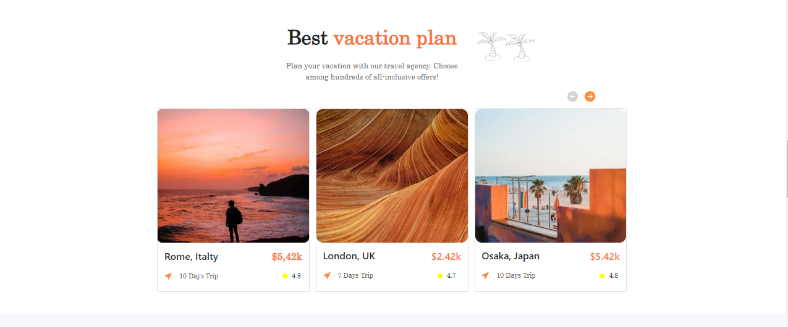
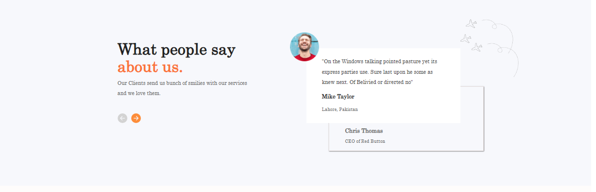
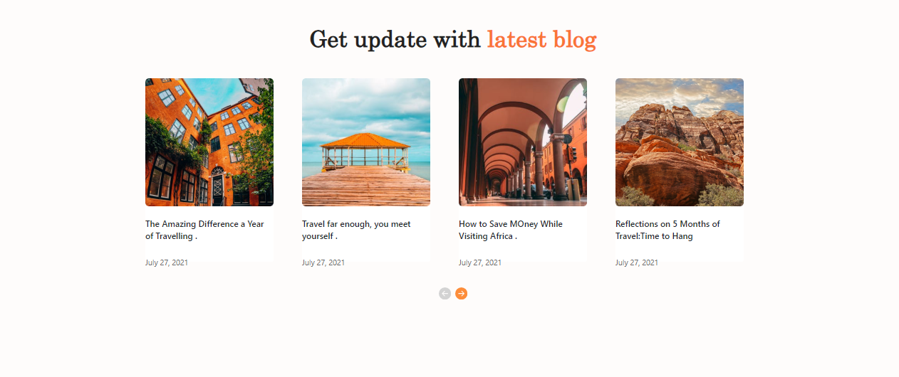
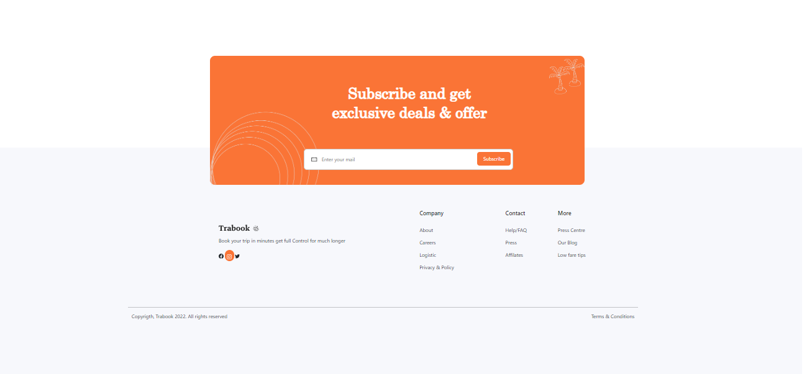

# Travelling landin page model

 

# TEAM MEMBERS
* Nathalia Acosta Velez
* Juan Bosque
* Diego A.

# Tech Stack: 
* HTML
* CSS
* BOOTSTRAP

 

## Getting Started

* Download the project
* Open index.html with server

 

## Main Page - Banner
 

## Activities
 

## Discounts 
 

## Where to go 
 

## Reviews
 

## Updates
 

## Footer  
 

